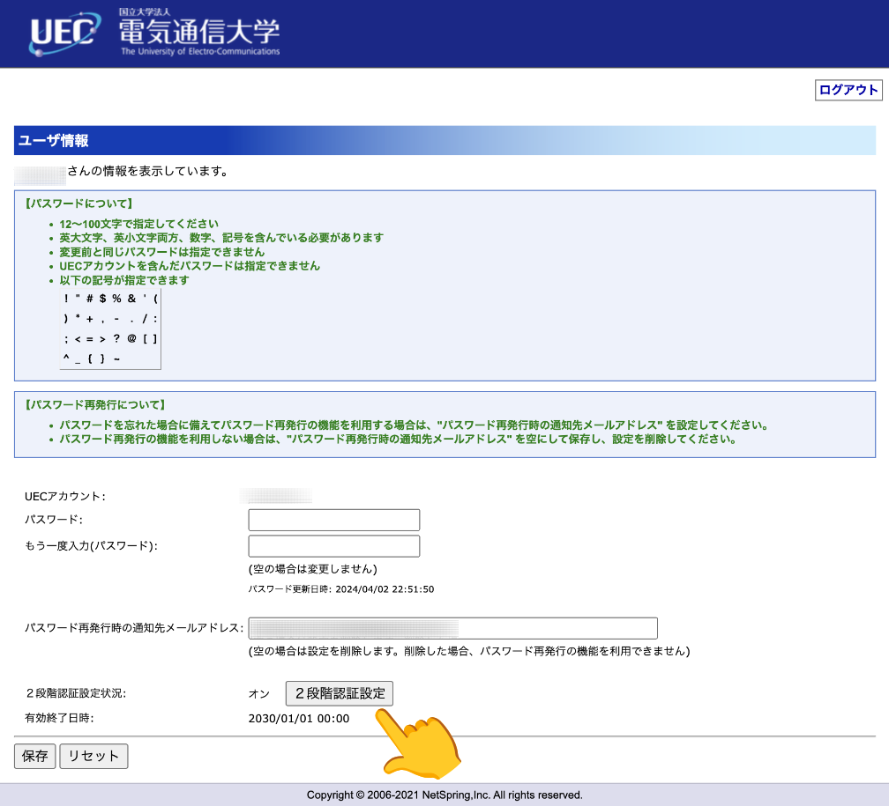
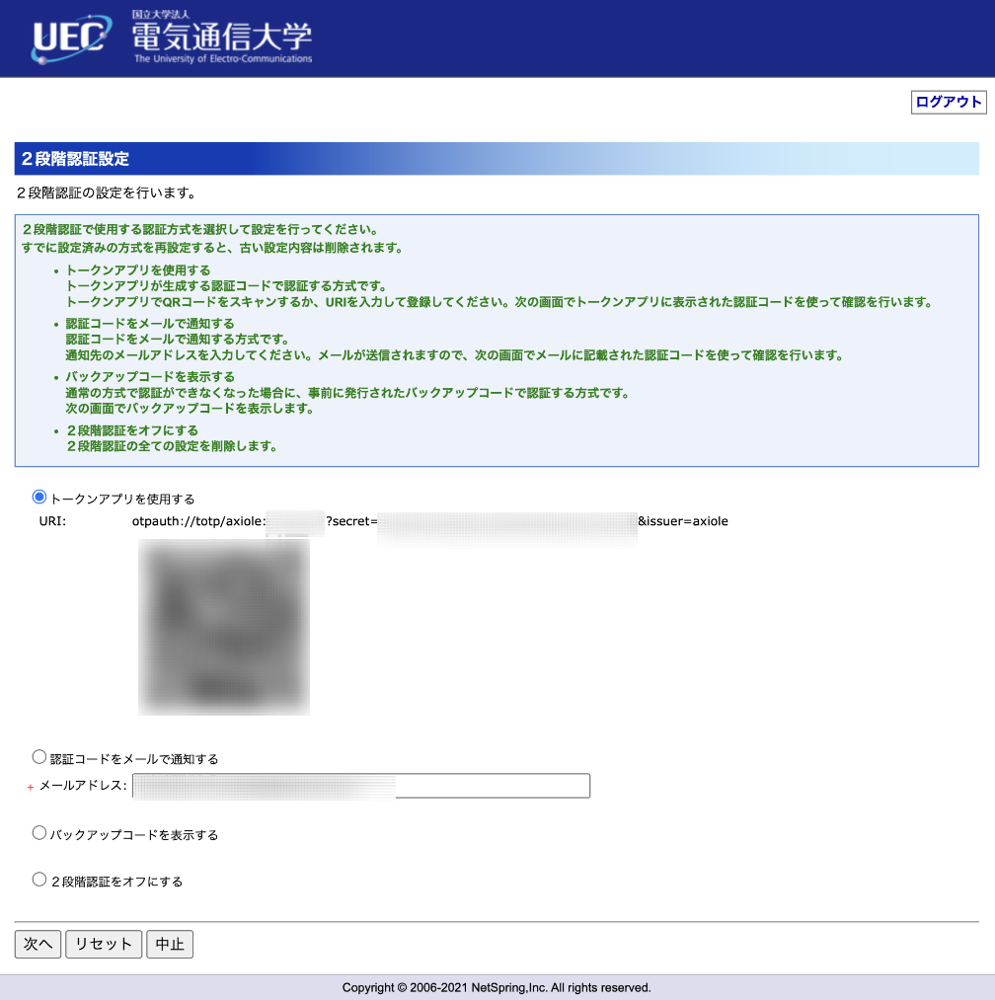

## 統合認証の二段階認証がめんどい
今回の記事は電気通信大学の学生向けの記事になります。

電通大の内部システムを利用するためには、UECアカウントでログインする必要がありますが、その度に二段階認証をする必要があって少し手間に感じます。

デフォルトでは、メールでの二段階認証となっていて、ログインの度にワンタイムパスワードがメールで送られてきて、それを入力するという形式になっています。
しかし、メールの受信に多少時間がかかるのと、いちいちメールアプリを起動する必要があるのでめんどくさいです。

また、専用アプリをスマホなどにインストールして、そのアプリで発行した6ケタの数字を入力するだけで認証できるトークン認証というものも用意されています。

しかし、これでも認証の際に毎回他のアプリを起動する必要があったりと、微妙にめんどくささが残ります。

そこで、ブラウザ上でトークンを発行できる方法を紹介します。

## トークン認証の設定
まず、メール認証のほうを使っている人もいると思うので、トークン認証に切り替える方法を説明します。

最初に、以下のサイトにアクセスして、UECアカウントでログインしてください。

https://axiole.cc.uec.ac.jp/

次に、二段階認証の設定を開きます。





ここで、QRコードの上のURIの`secret=`と`&issuer=axiole`の間の文字列が鍵となります。

それを下の入力欄に貼りつけてください。(ブラウザ上で実行されるので、サーバーに送信されたりはしません)

<script>
const genTOTP = () => (async (s)=>{const m=new Map([...Array.from('ABCDEFGHIJKLMNOPQRSTUVWXYZ234567',(k,i)=>[k,i])]);const c=new Uint8Array(s.length*5>>>3);let d=0;let l=0;let o=0;for(const e of s){d<<=5;d|=m.get(e);l+=5;if(l>=8){l-=8;c[o++]=d>>>l;}}const t=new ArrayBuffer(8);(new DataView(t)).setBigUint64(0,BigInt(Math.floor(Date.now()/30000)));const h=new Uint8Array(await crypto.subtle.sign('HMAC',await crypto.subtle.importKey('raw',c,{name:'HMAC',hash:'SHA-1'},0,['sign']),t));const q=h.at(-1)&0xf;document.querySelector('#displayToken').innerText='トークン: '+(((h[q]&0x7f)<<24|h[q+1]<<16|h[q+2]<<8|h[q+3])%(10**6)).toString().padStart(6,'0')})(document.querySelector('#tokenSecret').value)
</script>
<input id="tokenSecret" class="input input-bordered" />
<button onclick="genTOTP()" class="btn">発行</button>
<div id="displayToken" class="p-2"></div>

発行ボタンを押すとトークンが発行されます。

設定画面で「トークンアプリを使用する」というオプションを選択して「次へ」をクリックすると、トークンを入力する画面になるので、発行したトークンを入力して設定を完了してください。

「保存しました」と表示されたら成功です。

:::warning
トークンを発行する際に使用した`secret`の値は、あとでまた使うのでどこかにメモっておいてください。
:::

:::info
トークンは現在時刻の情報を基に生成されます。
トークンが間違っているというエラーが出たら、トークンが古い可能性があるので再度生成してみてください。
:::

## ブックマークレットを使用する
多くのブラウザは、ブックマークにプログラムを登録して任意のページで実行することができます。

これを「ブックマークレット」といいます。

つまり、前章で行った生成する処理を、ログインページで実行すれば、トークンを自動入力することができるという仕組みです。

(iOSのSafari、AndroidのChromeで動作確認済みです。)

まず、適当なページをブックマークに登録します。(今見ているこのページでいいです。)

Safariなら共有ボタンから、Chromeなら星マークのボタンから登録できると思います。

次に、登録したブックマークを編集します。

ブックマークの名前は適当に分かりやすい名前にして、URLの部分に以下の内容を入力してください。

```
javascript:(async (s)=>{const m=new Map([...Array.from('ABCDEFGHIJKLMNOPQRSTUVWXYZ234567',(k,i)=>[k,i])]);const c=new Uint8Array(s.length*5>>>3);let d=0;let l=0;let o=0;for(const e of s){d<<=5;d|=m.get(e);l+=5;if(l>=8){l-=8;c[o++]=d>>>l;}}const t=new ArrayBuffer(8);(new DataView(t)).setBigUint64(0,BigInt(Math.floor(Date.now()/30000)));const h=new Uint8Array(await crypto.subtle.sign('HMAC',await crypto.subtle.importKey('raw',c,{name:'HMAC',hash:'SHA-1'},0,['sign']),t));const q=h.at(-1)&0xf;document.querySelector('input[name=authcode]').value=(((h[q]&0x7f)<<24|h[q+1]<<16|h[q+2]<<8|h[q+3])%(10**6)).toString().padStart(6,'0')})('secretの値')
```

末尾の`secretの値`となっている部分を、トークン発行の際に使った`secret`の値に置き換えてください。

あとは、ログインの際にトークン入力の画面になったら、そのブックマークを実行すれば、トークンが自動で入力されます。

### スマホのChromeの場合
Androidスマホを使っている人は、スマホ版のChromeを使用している人も多いと思います。

その場合、ブックマーク一覧から実行しても何も起きませんが、ログイン画面でアドレスバーにブックマークの名前を入力すると、登録したブックマークが候補に出てくるので、それをタップして実行すれば動作します。

### ほかのデバイスで使いまわす場合
UECアカウントの設定で認証方法を設定する度に、`secret`の値が変わってしまうので、複数のデバイスで使いまわす場合は再度設定をするのではなく、ブックマークの情報をコピーするようにしてください。

## 参考文献
プログラムの作成には以下のサイトを参考にしました。

https://aquasoftware.net/blog/?p=2033
